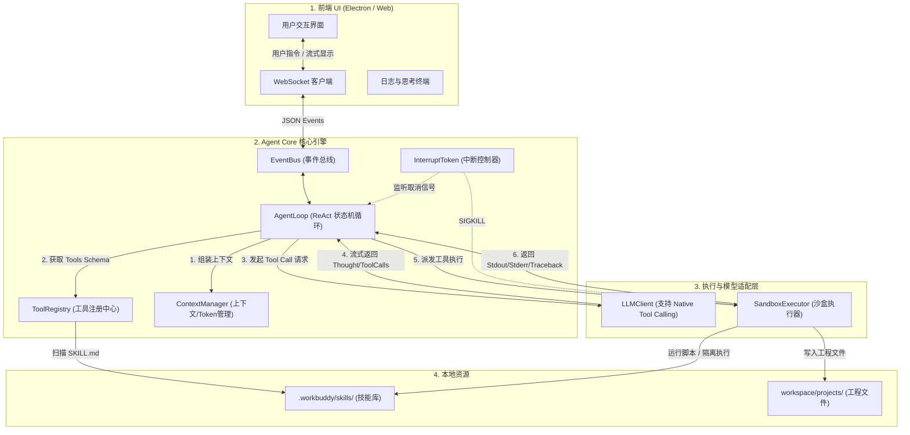
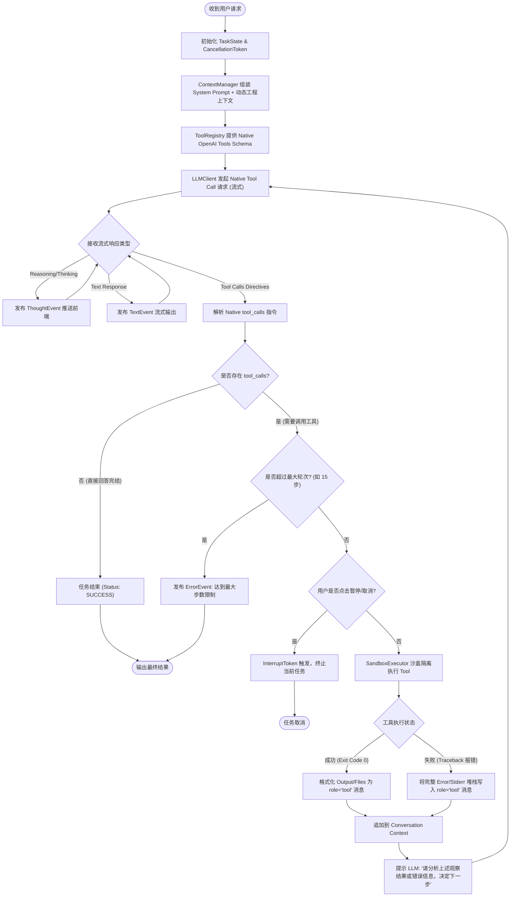
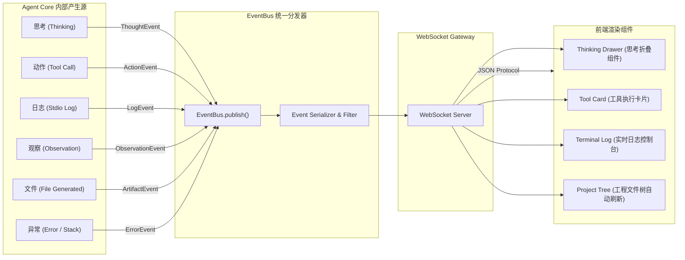

# agent core 
拒绝硬编码，充分使用ai 来实现智商工具 skill 等能力。
基础设计草案：
[agent_core.design.md](../agent_core.design.md)
## 详细设计
```python
import weasyprint
print(weasyprint.__version__)


```

```text
62.3


```

```python
import os
from weasyprint import HTML, CSS

html_content = """
<!DOCTYPE html>
<html lang="zh-CN">
<head>
<meta charset="utf-8">
<title>Agent Core 完整架构设计方案</title>
<style>
    @page {
        size: A4;
        margin: 15mm 12mm;
        background-color: #f8fafc;
        @bottom-right {
            content: "Page " counter(page) " of " counter(pages);
            font-size: 8pt;
            color: #64748b;
            font-family: 'PingFang SC', 'Microsoft YaHei', sans-serif;
        }
    }

    *, *::before, *::after {
        box-sizing: border-box;
    }

    body {
        font-family: -apple-system, BlinkMacSystemFont, "Segoe UI", Roboto, "Helvetica Neue", Arial, "PingFang SC", "Microsoft YaHei", sans-serif;
        color: #1e293b;
        margin: 0;
        padding: 0;
        font-size: 10pt;
        line-height: 1.5;
    }

    /* Header Banner */
    .header-banner {
        background-color: #0f172a;
        color: #ffffff;
        margin: -15mm -12mm 15px -12mm;
        padding: 22px 15mm;
        border-bottom: 4px solid #0284c7;
    }

    .header-banner h1 {
        margin: 0 0 6px 0;
        font-size: 20pt;
        font-weight: 700;
        color: #f8fafc;
        letter-spacing: -0.5px;
    }

    .header-banner .subtitle {
        font-size: 10pt;
        color: #94a3b8;
        margin: 0;
    }

    /* Meta Badges */
    .badge-container {
        margin-top: 10px;
    }

    .badge {
        display: inline-block;
        background-color: #1e293b;
        color: #38bdf8;
        padding: 3px 8px;
        border-radius: 4px;
        font-size: 8pt;
        font-weight: 600;
        margin-right: 6px;
        border: 1px solid #334155;
    }

    h2 {
        font-size: 13pt;
        color: #0f172a;
        border-left: 4px solid #0284c7;
        padding-left: 8px;
        margin-top: 20px;
        margin-bottom: 10px;
        page-break-after: avoid;
    }

    h3 {
        font-size: 11pt;
        color: #0369a1;
        margin-top: 14px;
        margin-bottom: 6px;
        page-break-after: avoid;
    }

    p {
        margin: 0 0 8px 0;
        text-align: justify;
    }

    /* Directory Tree Styling */
    .tree-box {
        background-color: #ffffff;
        border: 1px solid #cbd5e1;
        border-radius: 6px;
        padding: 12px;
        font-family: "Cascadia Code", "Fira Code", Consolas, "Courier New", monospace;
        font-size: 8.5pt;
        line-height: 1.4;
        color: #0f172a;
        margin-bottom: 12px;
        white-space: pre;
        box-shadow: 0 1px 3px rgba(0,0,0,0.05);
    }

    .tree-comment {
        color: #64748b;
        font-style: italic;
    }

    /* Diagrams Boxes */
    .diagram-card {
        background-color: #ffffff;
        border: 1px solid #cbd5e1;
        border-radius: 6px;
        padding: 12px;
        margin-bottom: 12px;
    }

    /* Tables */
    table {
        width: 100%;
        border-collapse: collapse;
        margin-bottom: 12px;
        background-color: #ffffff;
        border-radius: 6px;
        overflow: hidden;
        border: 1px solid #cbd5e1;
        font-size: 9pt;
    }

    th {
        background-color: #0f172a;
        color: #ffffff;
        text-align: left;
        padding: 7px 10px;
        font-weight: 600;
    }

    td {
        padding: 6px 10px;
        border-bottom: 1px solid #e2e8f0;
        vertical-align: top;
    }

    tr:nth-child(even) td {
        background-color: #f8fafc;
    }

    code {
        font-family: "Cascadia Code", "Fira Code", Consolas, monospace;
        background-color: #f1f5f9;
        color: #092e54;
        padding: 2px 4px;
        border-radius: 3px;
        font-size: 8.5pt;
        border: 1px solid #e2e8f0;
    }

    pre {
        background-color: #0f172a;
        color: #f8fafc;
        padding: 10px;
        border-radius: 6px;
        font-family: "Cascadia Code", "Fira Code", Consolas, monospace;
        font-size: 8pt;
        line-height: 1.4;
        overflow-x: auto;
        white-space: pre-wrap;
        word-break: break-all;
        margin: 0 0 10px 0;
        page-break-inside: avoid;
    }

    /* Callout Box */
    .callout {
        background-color: #f0f9ff;
        border-left: 4px solid #0284c7;
        padding: 8px 12px;
        border-radius: 0 6px 6px 0;
        margin-bottom: 12px;
        font-size: 9pt;
    }

    .callout-title {
        font-weight: bold;
        color: #0369a1;
        margin-bottom: 4px;
    }

    /* Workflow Box */
    .flow-step {
        background-color: #ffffff;
        border: 1px solid #cbd5e1;
        border-left: 4px solid #0284c7;
        padding: 8px 12px;
        margin-bottom: 8px;
        border-radius: 4px;
    }

    .flow-step-title {
        font-weight: bold;
        color: #0f172a;
        font-size: 9.5pt;
    }

    .flow-step-desc {
        color: #475569;
        font-size: 8.5pt;
        margin-top: 2px;
    }
</style>
</head>
<body>

<div class="header-banner">
    <h1>Agent Core 原生工具集智能体架构设计规范</h1>
    <div class="subtitle">解耦硬编码关键词 · Native Tool Calling · ReAct 循环 · 事件驱动与沙盒隔离</div>
    <div class="badge-container">
        <span class="badge">Architecture Spec v2.0</span>
        <span class="badge">ReAct State Machine</span>
        <span class="badge">OpenAI Function Calling</span>
        <span class="badge">Electron + Python Sandbox</span>
    </div>
</div>

<div class="callout">
    <div class="callout-title">核心设计思想转型 (Paradigm Shift)</div>
    从传统的“基于关键词正则匹配与强提示词 JSON 解析的脚本调度器”升级为“原生 Function Calling 驱动的自主 Agent”。智能体通过 ReAct（Reasoning & Acting）状态机循环独立完成<b>目标拆解、工具选择、沙盒执行、结果观察与自我纠错</b>。
</div>

<h2>一、Agent Core 系统整体架构图</h2>
<div class="diagram-card">
    <table>
        <tr>
            <th style="width: 25%;">分层结构</th>
            <th style="width: 40%;">核心模块组件</th>
            <th style="width: 35%;">职责说明</th>
        </tr>
        <tr>
            <td><b>交互展示层</b><br>(Electron / Web)</td>
            <td>• Frontend UI (React/Vue)<br>• WebSocket Client<br>• Stream Terminal & Project Tree</td>
            <td>负责用户指令输入、流式思考（Reasoning）与正文展示、工具调用状态推送与中断控制。</td>
        </tr>
        <tr>
            <td><b>通讯与总线层</b><br>(Event Gateway)</td>
            <td>• EventBus (Pub/Sub)<br>• WebSocket Manager<br>• Interrupt Token Manager</td>
            <td>统一管理异步事件推送，提供 `Thought`, `Action`, `Observation`, `Error`, `Artifact` 等标准化事件。</td>
        </tr>
        <tr>
            <td><b> Agent 核心内核</b><br>(Agent Core)</td>
            <td><b>1. AgentLoop ( ReAct 循环)</b><br><b>2. ToolRegistry (工具注册表)</b><br><b>3. ContextManager (上下文与 Token)</b></td>
            <td>• 维护自主 Task 状态机循环<br>• 将 SKILL.md 动态编译为 Native Tool Schemas<br>• 管理 Token 预算与滑动历史窗口</td>
        </tr>
        <tr>
            <td><b>执行与适配层</b><br>(Execution & Adapters)</td>
            <td>• SandboxExecutor (沙盒环境)<br>• LLMClient (模型统一适配器)<br>• Subprocess Wrapper</td>
            <td>• 独立隔离子进程执行 Tool，捕获 stdout/stderr/错误栈<br>• 统一支持 OpenAI / Claude / MiniMax 的 Function Calling</td>
        </tr>
        <tr>
            <td><b>底层资源库</b><br>(Resources)</td>
            <td>• `.workbuddy/skills/*`<br>• `workspace/projects/*`</td>
            <td>本地技能库目录与音乐工程文件目录。</td>
        </tr>
    </table>
</div>

<h2>二、Core 模块完整文件夹与文件目录树</h2>
<p>在后端架构中，将 <code>app/core/</code> 彻底重构为职责清晰的模块化设计：</p>

<div class="tree-box">app/core/
├── __init__.py                <span class="tree-comment"># 暴露 Core 统一导出接口 (AgentCore, AgentLoop, EventBus)</span>
├── agent_loop.py              <span class="tree-comment"># 核心：ReAct (Reasoning & Acting) 状态机循环与生命周期管理</span>
├── tool_registry.py           <span class="tree-comment"># 工具中心：解析 SKILL.md，动态生成 OpenAI Function Calling Schema</span>
├── sandbox_executor.py        <span class="tree-comment"># 沙盒执行器：隔离执行 Python/Subprocess，捕捉 stdout/stderr 与异常堆栈</span>
├── event_bus.py               <span class="tree-comment"># 事件总线：发布/订阅模式，处理实时流式事件推送与前端 Websocket 对接</span>
├── context_manager.py         <span class="tree-comment"># 上下文管理：Token 预算裁剪、系统提示词注入、动态工程状态感知</span>
├── llm_client.py              <span class="tree-comment"># 适配层：统一支持 Native Function Calling & Reasoning/Thinking 标签提取</span>
├── interrupt_token.py         <span class="tree-comment"># 控制中断：用户点击“暂停/取消”时的异步 Task 中断与沙盒进程 Kill</span>
├── schemas/                   <span class="tree-comment"># 结构化 Pydantic 数据类型定义</span>
│   ├── __init__.py
│   ├── events.py              <span class="tree-comment"># 各种 Event 定义 (ThoughtEvent, ActionEvent, ObservationEvent...)</span>
│   ├── tools.py               <span class="tree-comment"># Tool, ParameterSpec, FunctionCallSpec 定义</span>
│   └── agent_state.py         <span class="tree-comment"># TaskState, StepResult, LoopStatus 枚举</span>
└── utils/                     <span class="tree-comment"># 核心辅助工具集</span>
    ├── __init__.py
    ├── frontmatter_parser.py  <span class="tree-comment"># 高鲁棒性 SKILL.md YAML Frontmatter 解析器</span>
    ├── process_helpers.py     <span class="tree-comment"># UTF-8/Windows 编码绕过包装器与跨平台子进程拉起</span>
    └── prompt_templates.py    <span class="tree-comment"># 基础 Agent System Prompt 与 ReAct 指引模板</span></div>

<h2>三、核心交互与 ReAct 循环流</h2>

<div class="flow-step">
    <div class="flow-step-title">Step 1: 上下文感知与工具注册 (Context & Tools Load)</div>
    <div class="flow-step-desc">ToolRegistry 自动扫描 `.workbuddy/skills/`，将各个技能的 SKILL.md 定义编译为标准 JSON Schema。ContextManager 动态注入当前工程状态。</div>
</div>

<div class="flow-step">
    <div class="flow-step-title">Step 2: 发起模型调用 (Model Call with Native Tools)</div>
    <div class="flow-step-desc">LLMClient 带着 `messages` 和 `tools` 参数发起流式请求。流式接收 `reasoning_content` (思考过程) 并通过 EventBus 实时推送前端。</div>
</div>

<div class="flow-step">
    <div class="flow-step-title">Step 3: 判定工具调用 (Action Decision)</div>
    <div class="flow-step-desc">模型输出 `tool_calls`。AgentLoop 暂停文字生成，触发 `ActionEvent`。如果无需工具调用，输出正文并结束循环。</div>
</div>

<div class="flow-step">
    <div class="flow-step-title">Step 4: 沙盒隔离执行 (Sandbox Execution)</div>
    <div class="flow-step-desc">SandboxExecutor 根据 tool_name 分发：对于可执行脚本调起子进程隔离运行，捕获日志与产物；对于纯提示词技能交由模型子句执行。</div>
</div>

<div class="flow-step">
    <div class="flow-step-title">Step 5: 反馈观察与自主自我纠错 (Observation & Self-Correction)</div>
    <div class="flow-step-desc">将执行日志与产物（或 Traceback 报错信息）包装为 `role: "tool"` 消息追加回上下文，再次进入 Step 2。如报错，LLM 会自主分析错误并修正参数重新重试。</div>
</div>

<h2>四、关键组件接口规范摘要</h2>

<h3>1. ToolRegistry (工具注册中心)</h3>
<pre><code>class ToolRegistry:
    def scan_skills(self) -> List[ToolSpec]: ...
    def get_openai_tools_schema(self) -> List[dict]: ...
    def get_skill(self, tool_name: str) -> Optional[SkillMeta]: ...
</code></pre>

<h3>2. AgentLoop (ReAct 循环控制器)</h3>
<pre><code>class AgentLoop:
    async def run_task(
        self, 
        user_prompt: str, 
        project_name: str, 
        interrupt_token: InterruptToken
    ) -> AsyncGenerator[AgentEvent, None]: ...
</code></pre>

<h3>3. EventBus (事件定义)</h3>
<pre><code>class EventType(Enum):
    THOUGHT = "thought"          # 思考过程流
    ACTION = "action"            # 决定调用工具
    LOG = "log"                  # 工具运行实时日志
    OBSERVATION = "observation"  # 工具运行结果/观察
    TEXT = "text"                # 最终回复正文
    ERROR = "error"              # 异常事件
    ARTIFACT = "artifact"        # 生成工程产物通知
</code></pre>

</body>
</html>
"""

HTML(string=html_content).write_pdf("Agent_Core_Architecture_Design.pdf")
print("PDF generated successfully!")


```

```text
PDF generated successfully!


```

Your PDF file **`Agent_Core_Architecture_Design.pdf`** is ready:


---

为了彻底摆脱“硬编码关键词 + 强正则解析 JSON”的旧模式，我们需要构建一个真正的 **Native Tool Calling + ReAct（Reasoning & Acting）自主循环智能体**。

以下是为您设计的完整 **Agent Core 架构图**、**`core` 文件夹文件目录树**，以及 **4 张 Mermaid 流程图** 和 **核心代码组件规范**。

---

# 一、 系统总体架构图

Agent Core 采用**分层与事件驱动架构**，彻底解耦 LLM 意图理解、工具声明、沙盒执行与事件推送。

```
+-----------------------------------------------------------------------------------+
|                            1. 交互与展示层 (Frontend Layer)                        |
|   Electron Desktop / Web Terminal UI (React / Vue)                                |
|   - 思考流(Reasoning) / 正文流(Content) 分离展示                                      |
|   - 实时 Tool 调用卡片 / 日志终端 / 产物文件树预览                                   |
|   - 任务控制：暂停 (Pause) / 中断 (Interrupt Token)                                |
+-----------------------------------------------------------------------------------+
                                         |  WebSocket / SSE
                                         v
+-----------------------------------------------------------------------------------+
|                            2. 事件总线层 (Event Bus Layer)                        |
|   EventBus (Pub/Sub) <---> WebSocket Manager                                      |
|   标准化事件流：ThoughtEvent | ActionEvent | LogEvent | ObservationEvent | ErrorEvent |
+-----------------------------------------------------------------------------------+
                                         |
                                         v
+-----------------------------------------------------------------------------------+
|                            3. Agent Core 内核核心层                               |
|                                                                                   |
|  +-----------------------+     +-----------------------+     +------------------+ |
|  |      AgentLoop        |     |     ToolRegistry      |     |  ContextManager  | |
|  |  (ReAct 状态机循环)   |<--->|  (SKILL -> JSON Schema)|<--->|  (Token预算控制) | |
|  +-----------------------+     +-----------------------+     +------------------+ |
|              |                             |                          |           |
+--------------|-----------------------------|--------------------------|-----------+
               v                             v                          v
+-----------------------------------------------------------------------------------+
|                            4. 执行与适配层 (Execution Layer)                      |
|                                                                                   |
|  +--------------------------------+          +---------------------------------+  |
|  |        SandboxExecutor         |          |            LLMClient            |  |
|  | (子进程隔离/stdout捕获/错误栈解析) |          | (Native Tool Calling / Streaming)|  |
|  +--------------------------------+          +---------------------------------+  |
+-----------------------------------------------------------------------------------+
               |                                                        |
               v                                                        v
+-----------------------------------------------------------------------------------+
|                            5. 本地资源与工具层 (Resources)                          |
|   - `.workbuddy/skills/*`  (技能定义与可执行脚本)                                  |
|   - `workspace/projects/*` (歌曲工程资源目录)                                      |
+-----------------------------------------------------------------------------------+

```

---

# 二、 `app/core/` 文件夹文件目录树

这是重构后模块化、高复用、工业级的 `core` 目录结构：

```
app/core/
├── __init__.py                # 暴露 Core 统一对外导出接口 (AgentCore, AgentLoop, EventBus)
├── agent_loop.py              # 核心：ReAct (Reasoning & Acting) 状态机主循环与生命周期控制
├── tool_registry.py           # 工具注册中心：扫描 SKILL.md，动态生成 OpenAI Function Calling Schema
├── sandbox_executor.py        # 沙盒执行器：隔离执行 Python/Subprocess，捕捉 stdout/stderr 与 Traceback
├── event_bus.py               # 事件总线：Publish/Subscribe 模式，分发实时流式事件与 Websocket 对接
├── context_manager.py         # 上下文管理：Token 预算裁剪、System Prompt 组装、工程文本感知
├── llm_client.py              # 适配器：统一处理 Native Function Calling 与 Thinking/Reasoning 标签提取
├── interrupt_token.py         # 任务中断器：用户点击“暂停/终止”时的异步 CancellationToken 与进程 Kill
├── schemas/                   # Pydantic 结构化数据类型定义
│   ├── __init__.py
│   ├── events.py              # 各种 AgentEvent 定义 (Thought, Action, Log, Observation, Error...)
│   ├── tools.py               # ToolSpec, FunctionCallSpec, ParameterProperty 结构定义
│   └── agent_state.py         # TaskState, StepResult, LoopStatus 枚举与状态机定义
└── utils/                     # 核心底层辅助工具集
    ├── __init__.py
    ├── frontmatter_parser.py  # 高鲁棒性 SKILL.md YAML Frontmatter 解析器
    ├── process_helpers.py     # UTF-8/Windows 编码绕过包装器与跨平台子进程拉起
    └── prompt_templates.py    # Agent 基础 System Prompt 与 ReAct 引导模板

```

---

# 三、 美人鱼（Mermaid）流程图

### 1. 系统总体架构图 (System Architecture)



---

### 2. ReAct 状态机主循环流程图 (ReAct Agent Loop)

彻底放弃硬编码，通过模型的 `tool_calls` 和 Observation 观察反馈自动循环：



---

### 3. 工具调用与沙盒执行时序图 (Tool Call & Sandbox Execution Sequence)

```mermaid
sequenceDiagram
    autonumber
    actor User as 用户 (Frontend)
    participant Bus as EventBus
    participant Loop as AgentLoop
    participant Reg as ToolRegistry
    participant Sandbox as SandboxExecutor
    participant LLM as LLMClient
    participant Sub as Subprocess (Tool)

    User->>Bus: 发送指令: "分析音频并生成和弦"
    Bus->>Loop: 启动 run_task()
    Loop->>Reg: get_openai_tools_schema()
    Reg-->>Loop: 返回 Native JSON Schemas

    Loop->>LLM: chat_stream(messages, tools)
    
    rect rgb(240, 248, 255)
        note over LLM,Loop: 流式推理阶段
        LLM-->>Loop: Stream: reasoning_content ("我需要先提取BPM...")
        Loop->>Bus: publish(ThoughtEvent)
        Bus-->>User: 前端实时渲染思考折叠框
    end

    LLM-->>Loop: Finish Reason: tool_calls [audio_chord_recognizer]
    Loop->>Bus: publish(ActionEvent: tool_name, args)
    Bus-->>User: 前端高亮工具卡片: "正在执行 audio_chord_recognizer"

    Loop->>Sandbox: execute(tool_name, args, cancel_token)
    Sandbox->>Sub: 启动隔离子进程 (Python -X utf8 wrapper.py)
    
    loop 实时日志捕获
        Sub-->>Sandbox: stdout / stderr line
        Sandbox->>Bus: publish(LogEvent)
        Bus-->>User: 终端流式滚动日志
    end

    Sub-->>Sandbox: 退出码 Exit Code 0 + 生成文件列表
    Sandbox-->>Loop: 返回 StepResult (status="ok", output="BPM: 120", files=[...])

    Loop->>Bus: publish(ObservationEvent)
    
    note over Loop,LLM: 进入下一轮 ReAct 迭代
    Loop->>LLM: chat_stream(messages + tool_message)
    LLM-->>Loop: Stream: "提取完成，现在为您生成沙发音乐和弦..."
    Loop->>Bus: publish(TextEvent)
    Bus-->>User: 展示正文回复

```

---

### 4. 事件总线与前端通信架构图 (Event Stream Lifecycle)



---

# 四、 核心代码接口规范定义

为确保您可以直接落地代码，以下是 4 个关键核心文件的接口声明与骨架代码。

### 1. `tool_registry.py` (动态工具注册中心)

将 `SKILL.md` 自动化编译为大模型标准的 JSON Schema。

```python
# app/core/tool_registry.py
import json
import re
from pathlib import Path
from typing import Dict, List, Optional, Any
from .schemas.tools import ToolSpec, SkillMeta
from .utils.frontmatter_parser import parse_skill_frontmatter

class ToolRegistry:
    def __init__(self, skills_dir: Path):
        self.skills_dir = skills_dir
        self.skills: Dict[str, SkillMeta] = {}
        self.scan_skills()

    def scan_skills(self) -> Dict[str, SkillMeta]:
        """扫描 .workbuddy/skills/*/SKILL.md 并加载为注册表"""
        self.skills.clear()
        if not self.skills_dir.exists():
            return self.skills

        for skill_folder in sorted(self.skills_dir.iterdir()):
            if not skill_folder.is_dir():
                continue
            skill_md = skill_folder / "SKILL.md"
            if not skill_md.exists():
                continue

            meta = parse_skill_frontmatter(skill_md.read_text(encoding="utf-8"))
            name = meta.get("name", skill_folder.name)
            
            self.skills[name] = SkillMeta(
                name=name,
                description=meta.get("description", "").strip(),
                entry_script=meta.get("entry_script", ""),
                parameters=meta.get("params", {}),
                executable=meta.get("executable", False),
                skill_dir=skill_folder
            )
        return self.skills

    def get_openai_tools_schema(self) -> List[Dict[str, Any]]:
        """将本地所有 Skills 转换为标准的 OpenAI Function Calling Tools 结构"""
        tools_schema = []
        for name, meta in self.skills.items():
            properties = {}
            required = []
            
            for param_name, param_info in meta.parameters.items():
                # 兼容格式转换
                p_type = param_info.get("type", "string") if isinstance(param_info, dict) else "string"
                p_desc = param_info.get("description", "") if isinstance(param_info, dict) else str(param_info)
                p_req = param_info.get("required", False) if isinstance(param_info, dict) else False

                properties[param_name] = {
                    "type": p_type,
                    "description": p_desc
                }
                if p_req:
                    required.append(param_name)

            tools_schema.append({
                "type": "function",
                "function": {
                    "name": name,
                    "description": meta.description,
                    "parameters": {
                        "type": "object",
                        "properties": properties,
                        "required": required
                    }
                }
            })
        return tools_schema

```

---

### 2. `agent_loop.py` (ReAct 状态机循环内核)

驱动整个自主智能体的核心循环：思考 $\rightarrow$ 行动 $\rightarrow$ 观察 $\rightarrow$ 自我纠错。

```python
# app/core/agent_loop.py
import json
import logging
from typing import AsyncGenerator, List, Dict, Any
from .schemas.events import AgentEvent, EventType
from .tool_registry import ToolRegistry
from .sandbox_executor import SandboxExecutor
from .context_manager import ContextManager
from .llm_client import LLMClient
from .interrupt_token import InterruptToken

logger = logging.getLogger(__name__)

class AgentLoop:
    def __init__(
        self,
        tool_registry: ToolRegistry,
        sandbox_executor: SandboxExecutor,
        context_manager: ContextManager,
        llm_client: LLMClient,
        max_steps: int = 15
    ):
        self.registry = tool_registry
        self.sandbox = sandbox_executor
        self.context_mgr = context_manager
        self.llm = llm_client
        self.max_steps = max_steps

    async def run_task(
        self,
        user_prompt: str,
        project_name: str,
        history: List[Dict[str, Any]],
        interrupt_token: InterruptToken
    ) -> AsyncGenerator[AgentEvent, None]:
        """执行 ReAct 自主循环"""
        
        # 1. 初始化上下文与系统提示词
        messages = self.context_mgr.build_initial_messages(user_prompt, project_name, history)
        tools = self.registry.get_openai_tools_schema()

        step = 0
        while step < self.max_steps:
            step += 1
            if interrupt_token.is_cancelled:
                yield AgentEvent(type=EventType.ERROR, payload={"msg": "任务已被用户手动取消"})
                return

            # 2. 调用大模型发起 Reasoning & Action
            tool_calls = []
            assistant_msg_content = ""
            
            async for chunk_type, content in self.llm.chat_stream(messages, tools=tools):
                if interrupt_token.is_cancelled:
                    return

                if chunk_type == "reasoning":
                    yield AgentEvent(type=EventType.THOUGHT, payload={"content": content})
                elif chunk_type == "text":
                    assistant_msg_content += content
                    yield AgentEvent(type=EventType.TEXT, payload={"content": content, "done": False})
                elif chunk_type == "tool_calls":
                    tool_calls = content  # 接收到的 Native Tool Calls 列表

            # 3. 如果模型没有返回工具调用，说明已解答完毕
            if not tool_calls:
                yield AgentEvent(type=EventType.TEXT, payload={"content": "", "done": True})
                return

            # 4. 模型要求调用工具，追加 assistant 消息到上下文
            messages.append({
                "role": "assistant",
                "content": assistant_msg_content,
                "tool_calls": tool_calls
            })

            # 5. 遍历并发或串行执行工具调用
            for tool_call in tool_calls:
                if interrupt_token.is_cancelled:
                    return

                call_id = tool_call["id"]
                tool_name = tool_call["function"]["name"]
                tool_args = json.loads(tool_call["function"]["arguments"])

                yield AgentEvent(type=EventType.ACTION, payload={
                    "call_id": call_id,
                    "tool": tool_name,
                    "args": tool_args
                })

                # 6. 交给沙盒执行
                step_result = await self.sandbox.execute(
                    tool_name=tool_name,
                    args=tool_args,
                    project_name=project_name,
                    interrupt_token=interrupt_token,
                    on_log=lambda log: AgentEvent(type=EventType.LOG, payload={"tool": tool_name, "log": log})
                )

                # 7. 观察结果 Feedback
                yield AgentEvent(type=EventType.OBSERVATION, payload={
                    "call_id": call_id,
                    "tool": tool_name,
                    "status": step_result.status,
                    "files": step_result.files,
                    "output": step_result.output
                })

                # 8. 将工具执行结果 (Observation/Traceback) 作为 role: 'tool' 追加回上下文
                # 即使工具报错，完整错误栈也会给 LLM，实现自动 Error Recovery / Self-Correction
                tool_output_str = step_result.output if step_result.status == "ok" else f"工具执行报错:\n{step_result.error_stack}"
                
                messages.append({
                    "role": "tool",
                    "tool_call_id": call_id,
                    "content": tool_output_str
                })

                if step_result.files:
                    yield AgentEvent(type=EventType.ARTIFACT, payload={"files": step_result.files, "project": project_name})

        # 超过最大轮次
        yield AgentEvent(type=EventType.ERROR, payload={"msg": f"达到最大 ReAct 迭代步数 ({self.max_steps})，流程中止"})

```

---

### 3. `sandbox_executor.py` (沙盒隔离执行器)

提供进程隔离能力、标准输出实时捕获、UTF-8 Windows 编码适配，以及发生异常时的 Traceback 抓取。

```python
# app/core/sandbox_executor.py
import os
import sys
import json
import asyncio
import tempfile
from pathlib import Path
from typing import Callable, Optional, Dict, Any
from .schemas.agent_state import StepResult
from .interrupt_token import InterruptToken

class SandboxExecutor:
    def __init__(self, workbuddy_dir: Path, workspace_dir: Path, python_exe: str):
        self.wb_dir = workbuddy_dir
        self.ws_dir = workspace_dir
        self.python_exe = python_exe

    async def execute(
        self,
        tool_name: str,
        args: Dict[str, Any],
        project_name: str,
        interrupt_token: InterruptToken,
        on_log: Optional[Callable[[str], None]] = None
    ) -> StepResult:
        """安全隔离地执行工具子进程"""
        
        # 参数临时写文件以绕过 Windows CMD UTF-8 参数传递转义问题
        with tempfile.NamedTemporaryFile(mode='w', suffix='.json', encoding='utf-8', delete=False) as f_args:
            json.dump(args, f_args, ensure_ascii=False)
            args_file_path = f_args.name

        # 临时 Wrapper 封装脚本
        # ... 生成 wrapper.py ...
        
        cmd = [self.python_exe, "-X", "utf8", wrapper_path]
        logs = []

        try:
            env = dict(os.environ)
            env["PYTHONIOENCODING"] = "utf-8"

            process = await asyncio.create_subprocess_exec(
                *cmd,
                stdout=asyncio.subprocess.PIPE,
                stderr=asyncio.subprocess.STDOUT,
                cwd=str(self.wb_dir.parent),
                env=env
            )

            # 注册取消监听：一旦用户点击取消，立即 SIGKILL 子进程
            interrupt_token.register_callback(lambda: process.kill())

            # 逐行异步读取 Stdout/Stderr
            while True:
                line = await process.stdout.readline()
                if not line:
                    break
                decoded_line = line.decode('utf-8', errors='replace').rstrip()
                if decoded_line:
                    logs.append(decoded_line)
                    if on_log:
                        on_log(decoded_line)

            await process.wait()

            if process.returncode != 0:
                return StepResult(
                    status="error",
                    output="\n".join(logs),
                    error_stack=f"Subprocess 进程非零退出 (Exit Code: {process.returncode})\nLog summary:\n" + "\n".join(logs[-10:])
                )

            return StepResult(
                status="ok",
                output="\n".join(logs),
                files=self._detect_new_files(project_name)
            )

        except Exception as e:
            return StepResult(status="error", output="", error_stack=str(e))
        finally:
            # 清理 temp 文件
            Path(args_file_path).unlink(missing_ok=True)

```

---

## 总结：新架构带来的核心优势

1. **零硬编码依赖**：删除了所有 `if "新建" in msg` 的逻辑，完全基于模型原生的 Native Tool Calling 做出自主决策。


2. **多步逻辑与自主纠错**：模型不仅能一次性选择工具，还可以在工具报错时阅读完整的报错 Traceback，自动调整参数重新调用（Self-Correction）。
3. **响应式中断**：通过 `InterruptToken` 机制，用户在前端点击“取消/暂停”时，沙盒能在毫秒级响应并 Kill 掉 Python 子进程。
4. **前端无缝集成**：基于 `EventBus` 分发 `Thought`, `Action`, `Log`, `Observation` 事件，前端可以像 Claude Artifacts / OpenHands 一样优雅地渲染思考折叠框和动态卡片。
